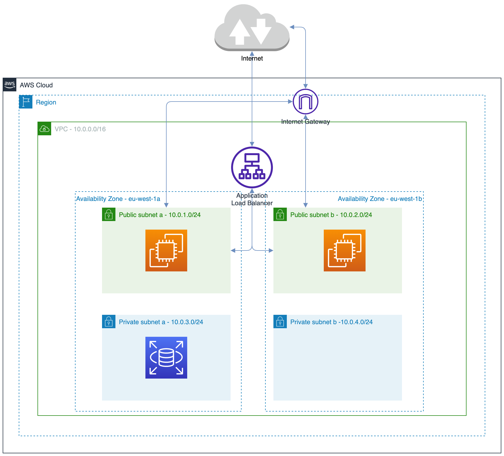
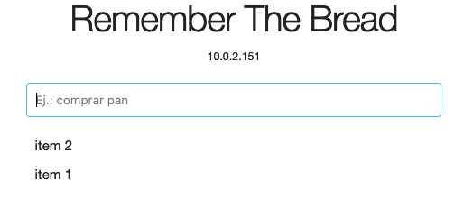

## Práctica: migración a la nube - AWS

### Indice

* [Objetivos y requisitos](#objetivos)
* [Infraestructura generada](#infra)
* [Creación de la infraestructura](#creacion)
* [Probando aplicación desplegada](#probando)
* [Datos necesarios para la corrección de la práctica](#datos-correcion)

<a name="objetivos"></a>
### Objetivos y requisitos de la práctica

La práctica consiste en la creación de la infraestructura necesaria para el despliegue de la aplicación web `Remember the Bread`, con los siguientes requisitos de infraestructura:

* 1 VPC con 4 subnets:
    * 2 privadas para la base datos
    * 2 públicas para el load balancer y la webapp 
* 1 base de datos MySQL en RDS
* 1 instancia EC2 para servir la webapp
* 1 load balancer para asegurar la distribución de las peticiones en la webapp

<a name="infra"></a>
### Infraestructura generada

Dados estos requisitos la infraestructura se ha creado la siguiente arquitectura:



<a name="creacion"></a>
### Creación de la infraestructura

Para la generación de la infraestructura se ha optado por el uso de Terraform. Tal y como se indicaba en la práctica se ha utilizado un único fichero [`main.tf`](main.tf). 

#### Requisitos previos - configuración AWS como provider

En el siguiente [enlace](https://registry.terraform.io/providers/hashicorp/aws/latest/docs) se detallan las diferentes posibilidades de configuración de las credenciales para poder hacer uso de AWS como provider de Terraform.

Se ha optado por el uso de la primera opción: la configuración del `secret_key` y del `access_key` directamente en el fichero `main.tf`:

```
provider "aws" {
  region     = "eu-west-1"
  secret_key = "..."
  access_key = "..."
}
```

#### Ejecución de terraform 

Una vez configuradas la `secret_key` y la `access_key`, para la creación de la infraestructura bastará con ejecutar:

```
terraform apply
```

<a name="probando"></a>
### Probando aplicación desplegada

Accedemos a la dirección DNS del balanceador proporcionada por AWS y comprobamos que la aplicación funciona correctamente:




