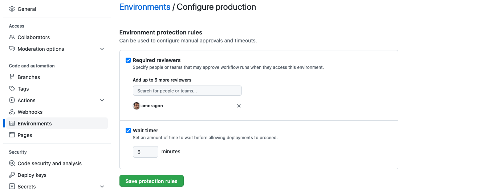
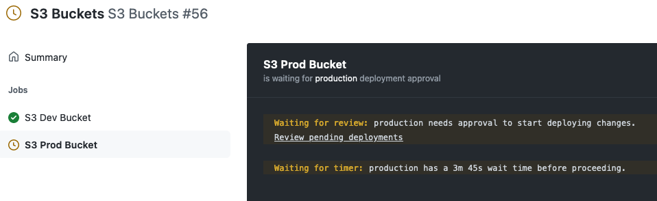
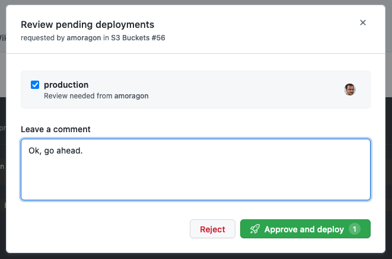

# Práctica Devops CI/CD Antonio Moragón

<a name="indice"></a>
## Indice
* [Enunciado y requerimientos](#enunciado)
* [Configuración credenciales AWS](#credenciales)
* [Proyecto Terraform](#terraform)
* [Makefile](#makefile)
* [DSL Jenkinsfile](#dsl)
* [Agente Terraform](#agente)
    *  [Problemas durante la construcción del agente](#problemas)
* [S3 Buckets Jenkinsfile](#s3buckets)
* [GitHub Actions](#actions)
* [Jenkinsfile de comprobación periódica](#periodico)

<a name="enunciado"></a>
## Enunciado y requerimientos
La empresa ACME quiere empezar a probar la nube, por lo que vamos a crear de manera totalmente automatizada unidades de almacenamiento en la nube (AWS S3, GCP Cloud Storage).

Los requerimentos que nos ha dado ACME son los siguientes:

* Quieren dos unidades de almacenamiento, pues tienen dos entornos: dev y prod. Por lo tanto estas unidades se llamarán respectivamente acme-storage-dev y acme-storage-prod
* Quieren que el flujo de despliegue para el entorno de dev sea totalmente automáticos, sin intervención manual
* Sin embargo, en el flujo de despliegue de prod hará falta que un administrador apruebe el despliegue
* Los desarrolladores de ACME han de poder hacer el despliegue desde sus máquinas para el entorno de dev
* Quieren que las credenciales para desplegar nunca estén guardadas en el código
* Además ACME también quiere revisar cada 10 minutos que el contenido que hay en cada una de las unidades de almacenamiento no supera los 20MiB. Si esto pasa, se vaciarán las unidades de almacenamiento
* ACME lleva usando Jenkins mucho tiempo pero está actualmente abriéndose a probar nuevas teconologías con menor coste de gestión como Github Actions. Es por esto que también se requiere un pipeline de github actions para el despliegue de la unidad de almacenamiento, de modo que ACME pueda comparar ambas tecnologías

__Nota:__ Se opta por el uso de AWS para la creación de las unidades de almacenamiento.

[Volver al índice](#indice)

<a name="credenciales"></a>
## Configuración credenciales AWS

Para la ejecución de Terraform contra AWS es neceario la configuración de las credenciales de acceso. Tal y como se indica en la documentación para AWS de Terrafom [existen varias formas de autenticación](https://registry.terraform.io/providers/hashicorp/aws/latest/docs#authentication-and-configuration). 

Para la ejecución del Makefile, se ha optado por usar el fichero de credenciales `$HOME/.aws/credentials`.

Para la ejecución del agente `amoragon/terraform-jenkins-agent` y de las GitHub Actions, se ha optado por usar las variables de entorno: `AWS_ACCESS_KEY_ID` y `AWS_SECRET_ACCESS_KEY`.

[Volver al índice](#indice)

<a name="terraform"></a>
## Proyecto Terraform

El proyecto se compone de 4 ficheros:

* `main.tf`
* `variables.tf`
* `dev.tfvars`
* `prod.tfvars`

Se ha optado por mantener el estado compartido del proyecto Terraform, debido a que este puede ejecutarse desde `Makefile, Jenkins o GitHub Actions`. Esto se ha realizado definiendo un [backend remoto](https://www.terraform.io/cdktf/concepts/remote-backends), donde se guarda el estado de la infraestructura.

```HCL
 backend "s3" {
    bucket = "kc-terraform-backend"
    key    = "backend"
    region = "eu-west-1"
 }
```

La definición del recurso del bucket se ha realizado de la siguiente manera:

```HCL
resource "aws_s3_bucket" "kc_acme_storage" {
  bucket = "${lookup(var.bucket, var.environment)}-${random_string.suffix.result}"

  tags = {
    Name        = lookup(var.bucket, var.environment)
    Environment = var.environment
  }
}
```

El nombre del bucket se obtendrá consultando el map `bucket`, usando como clave la variable `environment`, al nombre se le añade un string aleatorio para evitar una posible colisión de nombres. A continuación, la definión de las variables indicadas.

```HCL
variable "bucket" {
  type = map(any)
  default = {
    dev  = "kc-acme-storage-dev"
    prod = "kc-acme-storage-prod"
  }
}

variable "environment" {
  description = "dev or prod values"
  type        = string
}
```

De manera que los ficheros `dev.tfvars` y `prod.tfvars` establecen el valor de la variable `environment` a `dev` o `prod`, respectivamente.

Por último, comentar que se ha hecho uso de los [workspaces de Terraform](https://www.terraform.io/language/state/workspaces) para mantener aislados la infraestructura de cada entorno, y también, para facilitar la configuración de Terraform mediante el uso de una única cuenta.

[Volver al índice](#indice)

<a name="makefile"></a>
## Makefile

Para ejecutar el pipeline en local por parte de los desarrolladores, bastará con ejecutar: `make all`

El target `all` está compuesto a su vez por los siguientes targets:

* `clean`
* `init`
* `workspace`
* `format`
* `plan`
* `apply`

En el target `workspace` en lugar de limitarnos a crear el workspace `dev` sin más, se comprueba si existe dicho workspace. Si existe se selecciona, sino se crea.

```makefile
...
workspace:
    cd infra && \
    [[ $$(terraform workspace list | grep dev | wc -l) -eq 0 ]] && \
    terraform workspace new dev || \
    terraform workspace select dev
...
```
En cuanto al target `clean`, se realiza:

* un borrado de cualquier objeto dentro del bucket
* la eliminación del bucket en sí, y 
* el borrado del workspace `dev`

Esto se realiza en dos targets separados:

```makefile
...
# Clean DEV environment
clean: remove-objects remove-ws

# Removes objects in DEV S3 bucket, if it exists
remove-objects:
    @echo "Borrando objetos del bucket kc-acme-storage-dev..." && \
    [[ $$(aws s3 ls s3://kc-acme-storage-dev 2>&1 | grep "NoSuchBucket" | wc -l) -eq 0 ]] && \
    aws s3 rm s3://kc-acme-storage-dev --recursive  || \
    echo "No existe el bucket"

# Removes DEV bucket and workspace, if workspace exists
remove-ws:
    @cd infra && \
    [[ $$(terraform workspace list | grep dev | wc -w) -gt 0 ]] && \
    terraform workspace select dev && \
    terraform destroy -var-file="dev.tfvars" -auto-approve && \
    terraform workspace select default && \
    terraform workspace delete dev || \
    echo "No existe el workspace dev. No se puede eliminar."
```
[Volver al índice](#indice)

<a name="dsl"></a>
## DSL Jenkinsfile

En el fichero [`jenkinsfiles/Jenkinsfile.dsl`](jenkinsfiles/Jenkinsfile.dsl) definimos dos pipelineJob:

* __S3 Buckets__. Este pipeline se encargará de la creación de los buckets en S3.
* __Check Buckets Size__. Este pipeline se encargará de comprobar el espacio ocupado en los buckets creados anteriormente.

```groovy
pipelineJob('S3 Buckets') {
    definition {
        cpsScm {
            scm {
                git {
                    remote {
                        url("https://github.com/amoragon/cicd-practica-antonio.git")
                    }
                    branches("main")
                    scriptPath('Jenkinsfile.buckets')
                }
            }
        }
    }
}

pipelineJob('Check Buckets Size') {
    definition {
        cpsScm {
            scm {
                git {
                    remote {
                        url("https://github.com/amoragon/cicd-practica-antonio.git")
                    }
                    branches("main")
                    scriptPath('Jenkinsfile.cron')
                }
            }
        }
    }
}
```

[Volver al índice](#indice)

<a name="agente"></a>
## Agente Terraform

Cada uno de los anteriores pipelines, se ejecutarán dentro del agente Docker [`amoragon/terraform-jenkins-agent`](https://hub.docker.com/r/amoragon/terraform-jenkins-agent). 

```Dockerfile
FROM amoragon/base-jenkins-agent

# Terraform installation
RUN curl -fsSL https://apt.releases.hashicorp.com/gpg | apt-key add -
RUN apt-add-repository "deb [arch=$(dpkg --print-architecture)] https://apt.releases.hashicorp.com $(lsb_release -cs) main"
RUN apt install terraform

# AWS cli installation
RUN curl "https://awscli.amazonaws.com/awscli-exe-linux-aarch64.zip" -o "awscliv2.zip" && \
    unzip awscliv2.zip && \
    ./aws/install && \
    rm awscliv2.zip
```

Para construir y publicar la imagen se realiza con los comandos:

```
$ docker build -t amoragon/terraform-jenkins-agent -f agents/terraform.Dockerfile agents
$ docker push amoragon/terraform-jenkins-agent
```
<a name="problemas"></a>
### Problemas durante la construcción del agente 

#### Cambio en imagen base `amoragon/base-jenkins-agent`

Según se indica [aquí](https://www.terraform.io/cli/install/apt#supported-debian-and-ubuntu-releases), sólo hay soporte de paquetes APT para Terraform hasta la versión 20.10. La imagen base antiormente era la 21.10. Por lo que se ha procedido a cambiar la versión de la versión de Ubuntu a la 20.04 (LTS) en la imagen base. [Aquí](terraform-agent/base.Dockerfile) el Dockerfile de la imagen base.

#### Dockerfile diferente para trabajo en local

Dado que se hace uso de un Mac M1, se ha cambiado ligeramente el Dockerfile del agente terraform para poder trabajar en local. Concretamente la instalación de Terraform se ha realizado descargando directamente los binarios.

```Dockerfile
FROM amoragon/base-jenkins-agent

WORKDIR /opt

# Terraform installation
COPY terraform_1.1.7_linux_arm64.zip .
RUN unzip terraform_1.1.7_linux_arm64.zip && \
    mv terraform /usr/local/bin && \
    rm terraform_1.1.7_linux_arm64.zip

# AWS cli installation
RUN curl "https://awscli.amazonaws.com/awscli-exe-linux-aarch64.zip" -o "awscliv2.zip" && \
    unzip awscliv2.zip && \
    ./aws/install && \
    rm awscliv2.zip

```

Se incluyen los dos Dockerfile: 

 *  [`terraform-amd64.Dockerfile`](terraform-agent/terraform-amd64.Dockerfile)
 *  [`terraform-arm64.Dockerfile`](terraform-agent/terraform-arm64.Dockerfile)

[Volver al índice](#indice)

<a name="s3buckets"></a>
## S3 Buckets Jenkinsfile

En el Jenkinsfile [`jenkinsfiles/Jenkinsfile.buckets`](jenkinsfiles/Jenkinsfile.buckets) se selecciona el agente `amoragon/terraform-jenkins-agent` lo hacemos mediante el nuevo label `terraform`. A continuación se establecen las credenciales de acceso a AWS mediante variables de entorno. 

Por último, en la sección de opciones se indica que se imprima el __"timestamp"__ en cada línea de ejecución. Además, también se ha procedido a instalar el plugin [AnsiColor](https://plugins.jenkins.io/ansicolor/) para poder visualizar los colores que Terraform proporciona en su salida de log, y esto lo indicamos con la opción `ansiColor('xterm')`.

```groovy
pipeline {
    agent {
        label 'terraform'
    }

    environment {
        AWS_ACCESS_KEY_ID = credentials('terraform-secrety-key')
        AWS_SECRET_ACCESS_KEY = credentials('terraform-secret-access-key')
    }

    options {
        timestamps()
        ansiColor('xterm')
    }
...
```
A continuación definimos todas los stages que ya existían para el Makefile en el Jenkinsfile para los entornos de `development` y `production`.

Tal y como se indica en el enunciado establecemos un input para que el despliegue en producción lo apruebe un administrador.

```groovy
...
stage('Production - Apply') {
    steps {
        dir('infra') {
            input message: 'Do you want to create PROD env bucket?', ok: 'Yes, create bucket.'
                sh '''
                    terraform apply -var-file="prod.tfvars" -auto-approve
                '''
        }
    }
}
...
```

[Volver al índice](#indice)

<a name="actions"></a>
## GitHub Actions

En el fichero [`gha/gha-terraform.yml`](gha/gha-terraform.yml) se define el pipeline de GitHub Actions para el despliegue de los buckets de `development` y `production`.

Se definen dos jobs: `s3-dev-bucket` y `s3-prod-bucket`. Por defecto, GitHub Actions ejecuta los jobs de manera paralela, sin embargo, se ha optado por una ejecución secuencial, tal y como se estaba llevando a cabo hasta ahora con Jenkins. Este orden secuencial lo establecemos mediante la directiva `needs` como se puede ver:

```yaml
...
  s3-prod-bucket:
    name: 'S3 Prod Bucket'
    runs-on: ubuntu-latest
    environment: production
    needs: [s3-dev-bucket]
...
```
Para el establecimiento de las credenciales de AWS, previamente hemos guardado el access key y el secret access key como secretos del repositorio para luego poder rescatarlos y establecerlos como variables de entorno:

```yaml
...
    - name: Configure AWS Credentials
      uses: aws-actions/configure-aws-credentials@v1
      with:
        aws-access-key-id: ${{ secrets.AWS_ACCESS_KEY_ID }}
        aws-secret-access-key: ${{ secrets.AWS_SECRET_ACCESS_KEY }}
        aws-region: eu-west-1
...
```

En cuanto a la validación del despliegue del bucket de producción por parte de un administrador, esto se realiza en los __Settings__ del repositorio, concretamente para el entorno de production como se puede ver en la siguiente imagen.



Una vez se lanza el despliegue del bucket de producción podemos ver que GitHub Actions se queda esperando hasta que se apruebe el despliegue.



Una vez pulsamos a aprobar, nos pide explícitamente la validación y que introduzcamos un mensaje.



Una vez hecho esto, se procede con el despliegue.


[Volver al índice](#indice)

<a name="periodico"></a>
## Jenkinsfile de comprobación periódica

Además de [lo comentado](#s3buckets) para el Jenkinsfile de la creación de los buckets, en el Jenkinsfile [`jenkinsfiles/Jenkinsfile.cron`](jenkinsfiles/Jenkinsfile.cron) se ha añadido una variable de entorno `BUCKET_SIZE_LIMIT` con el valor límite de 20MiB.

```groovy
...
environment {
    AWS_ACCESS_KEY_ID = credentials('terraform-secrety-key')
    AWS_SECRET_ACCESS_KEY = credentials('terraform-secret-access-key')
    BUCKET_SIZE_LIMIT = 2097152 // 20 MiB in bytes 20 * 1024 * 1024
}
...
```

Se ha añadido un trigger que evalúa cada 10 minutos el tamaño de cada uno de los buckets, en caso de que supere el tamaño, se procede al borrado del contenido de los mismos.

```groovy
...
triggers {
    cron('*/10 * * * *')
}

stages {
    stage('Check bucket size in DEV bucket') {
        steps {
            dir('infra') {
                sh '''
                    BUCKET_DEV=$(aws s3 ls | grep dev | cut -d " " -f 3)
                    [[ $(aws s3 ls s3://"${BUCKET_DEV}" --recursive  --summarize | tail -1 | cut -d : -f 2) -gt ${BUCKET_SIZE_LIMIT} ]] && \
                    aws s3 rm s3://"${BUCKET_DEV}" --recursive || \
                    echo "No se ha llegado al limite de ${
                '''
            }
        }
    }

    stage('Check bucket size in PROD bucket') {
        steps {
            dir('infra') {
                sh '''
                    BUCKET_PROD=$(aws s3 ls | grep prod | cut -d " " -f 3)
                    [[ $(aws s3 ls s3://"${BUCKET_PROD}" --recursive  --summarize | tail -1 | cut -d : -f 2) -gt ${BUCKET_SIZE_LIMIT} ]] && \
                    aws s3 rm s3://"${BUCKET_PROD}" --recursive || \
                    echo "No se ha llegado al limite de ${BUCKET_SIZE_LIMIT}."
                '''
            }
        }
    }
 }
...
```

[Volver al índice](#indice)
