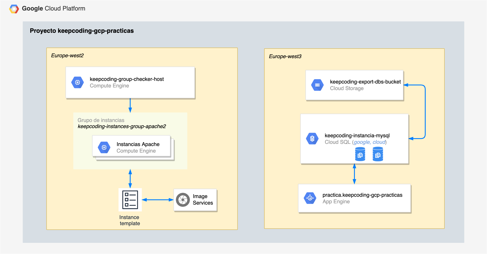

# Práctica Google Cloud Platform

## Indice

* [Descripción de la práctica](#descripcion)
* [Diagrama](#diagrama)
* [Sobre la comprobación del autoescalado](#autoescalado)
* [Bonus](#bonus)


<a name="descripcion"></a>
## Descripción de la práctica

Esta práctica está divida en diferentes partes. En cada una de ellas hay que realizar las siguientes tareas:

* Creación de una base de datos MySQL mediante CloudSQL, configuración de copias de seguridad, exportación de base de datos.
* Creación de imagen que servirá de base para la creación de un grupo de autoescalado.
* Creación de máquina virtual independiente con un script para comprobar el funcionamiento del grupo de autoescalado.
* Despliegue de una [aplicación](https://github.com/GoogleCloudPlatform/python-docs-samples/tree/master/ap
pengine/standard/cloudsql) en Google App Engine
* __Bonus__: Crear los siguientes recursos con Terraform:
    * Red virtual
    * Bucket de almacenamiento en Cloud Storage
    * Aprovisionar máquina enlazada a la red virtual creada.

<a name="diagrama"></a>
## Diagrama de la práctica realizada



<a name="autoescalado"></a>
## Sobre la comprobación del autoescalado

Para la realización del script que fuerza el autoescalado de instancias se ha optado por el uso de la herramienta `siege`, para esto se ha procedido a su instalación previa con las instrucciones:

```
sudo apt update
sudo apt install siege -y
```

También indicar que se ha optado por el autodescubrimiento de la ip a "atacar" para forzar el autoescalado.

En el fichero [`scale-instances.sh`](scale-instances.sh) primero se comprueba el número de instancias levantadas. Si están levantadas el máximo de instancias se avisa de esto antes de poder continuar. En caso de que no estén todas levantadas, averiguamos la ip a la que "atacar", y se procede a realizar peticiones mediante `siege` hasta que el número de instancias levantadas varíe. 

<a name="bonus"></a>
## Bonus

En el fichero [`main.tf`](main.tf) se puede consultar la creación de los diferentes recursos solicitados en para esta parte.