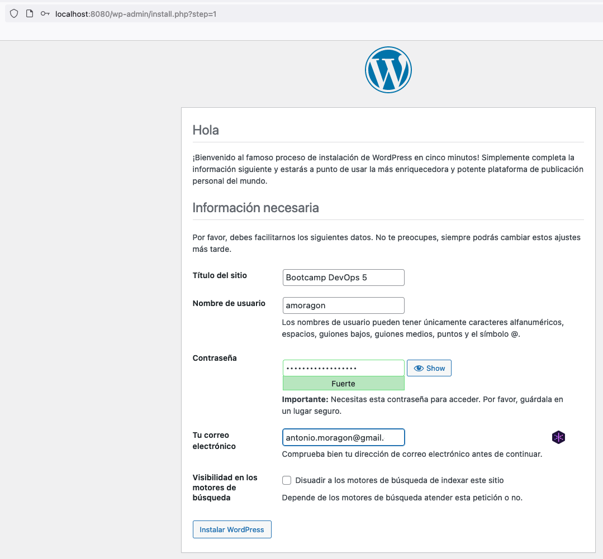
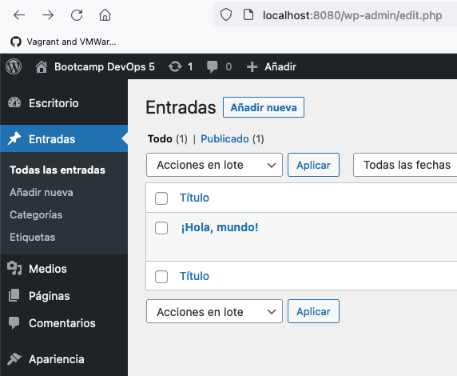
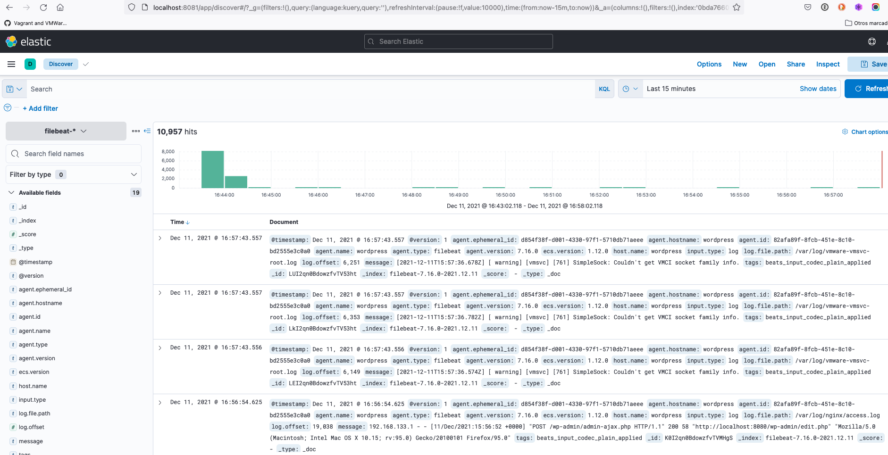
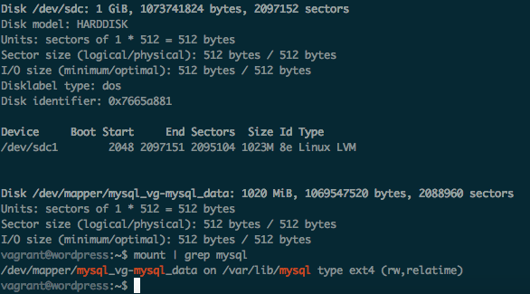
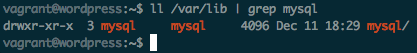
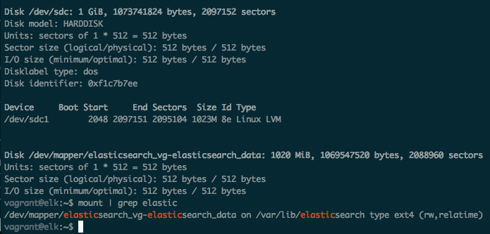
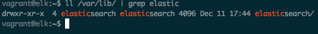

# Práctica Sysadmin

## Indice

* [Descripción de la práctica](#descripcion)
* [Puesta en marcha](#marcha)
* [Comprobación de funcionamiento](#funcionamiento)
    * [Wordpress](#wordpress)
    * [ELK](#elk)
* [Configuración de discos externos](#discos)


<a name="descripcion"></a>
## Descripción de la práctica

La práctica consiste en el aprovisionamiento de dos máquinas, de manera que en la primera de ellas se instale Wordpress, con su base de datos MariaDB y con el agente Filebeat para el envío de logs. 
Dicho envío de logs se realizará hacia la segunda máquina, donde se instalará la pila ELK (ElasticSearch, Logstas y Kibana) para el procesamiento de los logs que se reciban del servicio Wordpress.

<a name="marcha"></a>
## Puesta en marcha

Para la puesta en marcha del aprovisionamiento bastará con ejectuar:

```
vagrant up
```

Una vez se ejecute esta instrucción se levanta la máquina destinada a albergar la pila ELK, procediendo a instalar todo el software necesario. A continuación, se levanta la siguiente máquina, donde se instala WordPress.

<a name="funcionamiento"></a>
## Comprobación de funcionamiento

<a name="wordpress"></a>
### WordPress

Para comprobar que Wordpress se ha instalado correctamente bastará con ir a la URL http://localhost:8080.

Una vez en esta pantalla se nos mostrará el asistente de instalación como podemos ver a continuación.



Procedemos a realizar la instalación pudiendo así navegar por las diferentes páginas del panel de control y la página principal del sitio.



<a name="elk"></a>
### ELK

Una vez realizada la instalación de WordPress, comprobamos que la pila ELK se ha instalado correctamente. Para esto habrá que ir a la URL http://localhost:8081.

Se nos solicitará la autenticación básica. Para autenticarnos habrá que introducir:

**user:** kibanaadmin
**password:** kibanaadmin

Se siguen los pasos descritos en el enunciado de la práctica para la configuración de Kibana. De manera que si pulsamos en **Discover** después de configurar el **Index Pattern** podemos ver lo siguiente



<a name="discos"></a>
## Configuración de discos externos para MariaDB y ElasticSearch

Como se indicaba en la nota aclaratoria inicial, en un principio no había podido realizar esta parte por usar VMWare para Mac. Sin embargo, he podido rescatar un iMac antiguo con el cual he podido realizar dicha configuración. Estos cambios los he subido a la rama **virtualbox**.

He podido comprobar que Wordpress arranca correctamente y el disco queda montado en la ruta `/var/lib/mysql`, como se puede ver en la siguiente captura.



También se puede ver que el directorio tiene el dueño mysql en la siguiente captura.



Por otro lado, el disco para ElasticSearch también queda igualmente montado en la ruta `/var/lib/elasticsearch`, tal y como se puede ver en la captura siguiente.



Respecto al dueño del directorio se puede ver en la siguiente captura.

